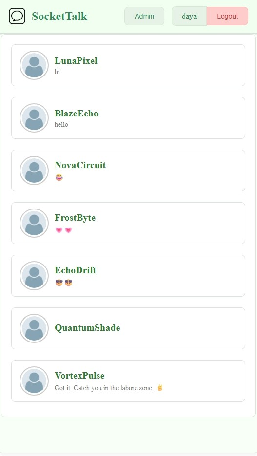
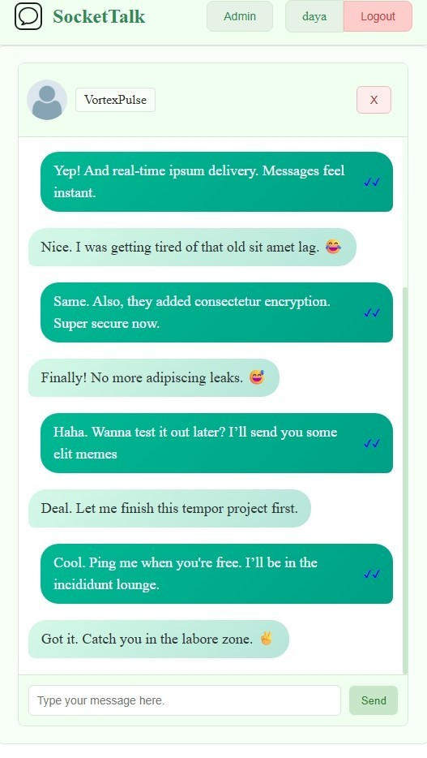

# 💬 RealTime Chat Application

A modern, full-stack real-time chat application built with the MERN stack and Socket.IO for instant communication.

Live Demo: https://real-time-chat-app-iivu.onrender.com/

## ✨ Features

### 🔥 Core Functionality

- **Real-time messaging** with Socket.IO
- **Message status indicators** (Sent ✓, Delivered ✓✓, Read ✓✓)
- **Online/Offline user status** with live updates
- **Persistent message storage** with MongoDB
- **User authentication** (Register/Login)
- **Live Notification** for new messages
-  **Ai Integration** for automatic messaging

### 👑 Admin Features

- **Admin dashboard** for user management
- **User deletion** with forced logout capability
- **Real-time user monitoring**

### 🎨 User Experience

- **Smooth CSS animations** and transitions
- **Error handling** with visual feedback
- **Responsive design** for all devices
- **Intuitive UI/UX** with modern design patterns

## 🛠️ Tech Stack

| Frontend                                                                                            | Backend                                                                                                  | Database                                                                                                 | Real-time                                                                                                       |
| --------------------------------------------------------------------------------------------------- | -------------------------------------------------------------------------------------------------------- | -------------------------------------------------------------------------------------------------------- | --------------------------------------------------------------------------------------------------------------- |
|  |  |  |  |

## 🚀 Quick Start

### Prerequisites

- Node.js (v14+)
- MongoDB
- npm or yarn

### Installation

1. **Clone the repository**

   ```bash
   git clone https://github.com/Daya1222/Real-time-chat-app.git
   cd Real-time-chat-app
   ```

2. **Install dependencies**

   ```bash
   # Backend dependencies
   cd backend
   npm install

   # Frontend dependencies
   cd frontend
   npm install
   ```

3. **Environment Setup**

   ```bash
   # Create .env file in root directory
   JWT_SECRET=your_jwt_secret_here
   ```

4. **Start the application**

   ```bash
   # Development mode (runs both frontend and backend)
   npm run dev


   ```

5. **Open your browser**
   ```
   http://localhost:5173
   ```

## 📱 Screenshots

<div align="center">

## 📸 Demo Screenshots

<p align="center">
  
  
  
</p>

</div>

## 🔧 Key Features Breakdown

### Real-time Communication

- **Socket.IO integration** for instant message delivery
- **Connection state management** with auto-reconnection
- **Room-based messaging** for organized conversations

### Message System

- **Delivery confirmations** with visual status indicators
- **Message persistence** in MongoDB
- **Timestamp tracking** for message history

### User Management

- **JWT-based authentication** for secure sessions
- **Password encryption** with bcrypt
- **Admin privileges** for user moderation

### Performance Optimizations

- **Efficient database queries** with MongoDB indexes
- **Message pagination** for large conversations
- **Optimized re-renders** with React best practices

### AI Integration
- **Smart Reply Assistant**: A built-in AI button enables users to generate context-aware replies with a single click, streamlining conversations and reducing typing effort.


## 🏗️ Project Structure

```
├── backend/
│   ├── models.jsx         # MongoDB schemas
│   ├── chat-apis.jsx      # API endpoints/socket.IO handlers
│   └── auth.jsx           # Auth & validation
├── frontend/
│   ├── src/
│   │   ├── components/  # React components
│   │   ├── pages/       # Main pages
│   │   ├── css/         # Css
│   │   └── assets       # pngs
│   └── public/
└── README.md
```

## 🎯 Why This Project?

This chat application demonstrates:

- **Full-stack development** expertise with modern technologies
- **Real-time programming** skills using WebSockets
- **Database design** and management with MongoDB
- **User authentication** and security implementation
- **Admin panel** development for content moderation
- **Responsive UI/UX** design principles
- **State management** in React applications

## 🤝 Contributing

Contributions are welcome! Please feel free to submit a Pull Request.

## 📄 License

This project is licensed under the MIT License - see the [LICENSE](LICENSE) file for details.

---

<div align="center">

**⭐ Star this repository if you found it helpful!**

Made with ❤️ by [Daya]

</div>
