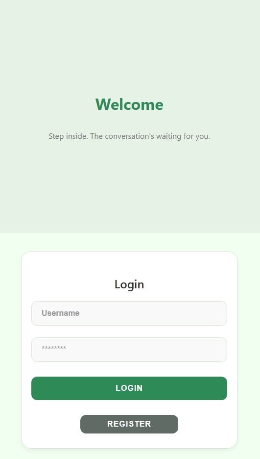

# 💬 SocketTalk

A real-time chat application built with the MERN stack and Socket.IO for instant messaging.

[](https://real-time-chat-app-iivu.onrender.com/)

## 📸 Screenshots

<p align="center">
  
  
  
</p>

## ✨ Features

- **Real-time messaging** with Socket.IO
- **Message status indicators** (Sent ✓, Delivered ✓✓, Read ✓✓)
- **Online/Offline status** with live updates
- **AI-powered replies** for quick responses
- **Admin dashboard** for user management
- **JWT authentication** with secure sessions
- **Fully responsive** design for all devices

## 🛠️ Tech Stack

**Frontend:** React.js | **Backend:** Node.js, Express.js | **Database:** MongoDB | **Real-time:** Socket.IO

## 📁 Project Structure
```
├── backend/
│   ├── models.jsx         # MongoDB schemas
│   ├── chat-apis.jsx      # API & Socket.IO handlers
│   └── auth.jsx           # Authentication
├── frontend/
│   └── src/
│       ├── components/    # React components
│       ├── pages/         # Main pages
│       └── css/           # Stylesheets
└── README.md
```

## 📄 License

MIT License - see [LICENSE](LICENSE) for details.

---

<div align="center">

⭐ **Star this repo if you find it helpful!**

Made with ❤️ by [Daya](https://github.com/dayaj1222)

</div>
